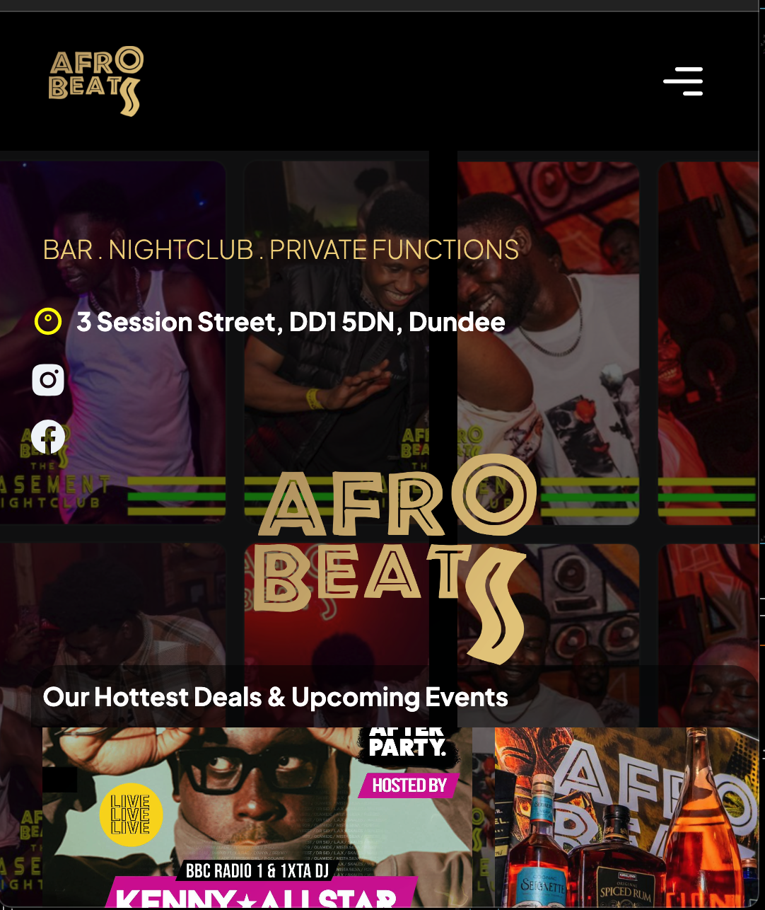

## Language Breakdown

## My Projects

### Project 1: Afro Beats Night club

  

Afro Beats Night club website

### Hi there 👋
I'm Ntina, a passionate computer science student in my fourth year of studies. I have a keen interest in exploring various fields of computer science, and currently, I'm focused on expanding my knowledge in machine learning.

My journey into Open Source is a thrilling adventure, particularly within the realm of machine learning. I'm in the process of unraveling its intricacies and I'm committed to continuous growth. If you're willing to share your expertise or collaborate, don't hesitate to connect with me on LinkedIn or drop me a line at isaiahntina47@gmail.com.

💡 This GitHub profile serves as a space where I share my projects, experiments, and learnings. Feel free to explore my repositories and provide feedback or suggestions. Let's connect and learn together!

📫 You can reach me via email at isaiahntina47@gmail.com. I'm always open to discussions, collaborations, and learning opportunities.

Let's embrace the journey of continuous learning and exploration in the fascinating world of computer science and machine learning! 🚀
